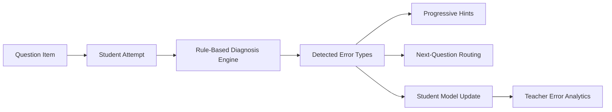

# diagno

`diagno` is a diagnostic tutoring system for high school physics.

It is not a quiz app and not a generic AI chat wrapper.

The core idea is simple:

> Given a student's answer, identify where the student likely failed in the problem-solving process, then provide the right hint, remediation, and next step.

The current MVP focuses on a Taiwan high school physics context, using binary-system problems around center of mass and angular momentum.

## Demo Flow

The current MVP interaction loop is:

1. the student opens a physics item
2. the student submits an answer
3. the system diagnoses likely failure points
4. the system reveals progressive hints
5. the system recommends a remediation or next question
6. the teacher view aggregates error patterns across attempts

This means the product is centered on the learning loop, not on question delivery alone.

## Why This Project Exists

Many learning tools can tell a student whether an answer is correct.

Far fewer can answer the more useful question:

> What exactly went wrong in the student's reasoning?

In real teaching, the valuable part is not grading. It is diagnosis.

A teacher does not just say "wrong." A teacher notices things like:

- the student ignored the reference frame
- the student reversed the center-of-mass relation
- the student only counted one body's angular momentum
- the student had the right structure but made an algebra mistake

`diagno` is an attempt to encode that judgment explicitly.

## Product Thesis

Questions are only the interface.

The actual product is the diagnosis engine:

- concept modeling
- error taxonomy
- rule-based diagnosis
- progressive hints
- remediation routing
- lightweight student modeling

This makes the system closer to an automated tutor than a question bank.

## What Makes This Different

Compared with a typical quiz system, `diagno` is optimized for:

- identifying likely misconceptions instead of just grading answers
- returning multiple error signals when a mistake is compounded
- giving scaffolded hints instead of jumping straight to a solution
- selecting the next instructional move instead of only showing the next question

Compared with a generic LLM tutor, the current MVP is:

- narrower in scope
- more inspectable
- easier to test
- easier to evaluate against teacher expectations
- clearer about why a given diagnosis was produced

## Current Scope

Current MVP topic:

- center of mass
- tangential speed from angular speed
- momentum in the center-of-mass frame
- single-particle angular momentum
- total angular momentum in a multi-body system
- combined binary-system problems

Current MVP behavior:

- serve seeded physics questions
- accept student answers
- detect one or more likely error types
- provide multi-level hints
- recommend a next question
- track simple concept mastery and recent error patterns
- show teacher-facing error distribution

## Core Design Principles

### 1. Diagnosis First

The primary output is not a score. It is a structured judgment about why the student failed.

### 2. Small, Curated Data

The MVP uses a small hand-authored dataset on purpose.

The goal is not content scale. The goal is correctness and clarity of diagnosis logic.

### 3. Rule-Based Before LLM

The current engine is rule-based and inspectable.

That is intentional:

- easier to debug
- easier to test
- easier to explain
- better for making the pedagogical model explicit

### 4. Clean Boundaries for Future Expansion

`diagno` is designed so OCR, RAG, and LLM-assisted content generation can be added later without collapsing the tutoring logic into a black box.

## System Architecture

The MVP is a minimal full-stack app:

- `FastAPI` backend
- `React + TypeScript + Vite` frontend
- typed Python models
- in-memory persistence
- rule-based diagnosis engine

Main backend modules:

- [app/models.py](app/models.py): domain entities and response models
- [app/data.py](app/data.py): seeded concepts, error types, and questions
- [app/diagnosis.py](app/diagnosis.py): diagnosis and routing logic
- [app/store.py](app/store.py): in-memory attempts and student state
- [app/i18n.py](app/i18n.py): bilingual `en` / `zh-TW` content layer
- [app/main.py](app/main.py): API and production app serving

Frontend assets:

- [frontend/src/App.tsx](frontend/src/App.tsx)
- [frontend/src/components.tsx](frontend/src/components.tsx)
- [frontend/src/styles.css](frontend/src/styles.css)

High-level architecture:



Current backend responsibility split:

- content and domain definitions live in typed models and seed data
- diagnosis and routing live in deterministic application logic
- presentation and interaction live in a lightweight bilingual frontend

This keeps the instructional policy layer easy to inspect and evolve.

## Data Model

The MVP defines five core entities:

- `Concept`
- `ErrorType`
- `Question`
- `Attempt`
- `StudentModel`

This structure is designed to make future tutoring decisions explicit instead of hiding them inside prompt behavior.

## Diagnosis Logic

For each question, wrong answers map to one or more likely error types.

Examples from the current physics scope:

- ignoring the center-of-mass frame condition
- reversing the distance relation in center-of-mass geometry
- misusing `v = omega r`
- missing one body when summing total angular momentum
- treating opposite momenta as if they point in the same direction
- making an algebraic simplification error after setting up the physics correctly

Multiple errors can be returned for the same attempt.

In the current implementation, diagnosis is based on:

- answer-option mappings for known distractors
- derived rules for selected high-value composite mistakes
- deterministic next-question routing rules

This is intentionally modest. The goal is to make the pedagogical structure visible before adding more automation.

## Hinting and Remediation

Each error type includes progressive hints:

1. conceptual reminder
2. structural hint
3. near-solution scaffold

The system also routes the learner to an appropriate next question based on the detected error pattern.

Example progression:

- error: `ignore_reference_frame`
- hint 1: remind the student to identify the reference frame
- hint 2: ask for the total momentum in the center-of-mass frame
- hint 3: scaffold the conclusion that the total momentum must be zero

This pattern is closer to teacher prompting than answer reveal.

## Bilingual Interface

The MVP currently supports:

- `en`
- `zh-TW`

The localization layer covers:

- UI labels
- question statements
- answer options
- concept descriptions
- error descriptions
- hint text

## Relationship to Bibliophilist

`diagno` is intentionally separate from [`bibliophilist`](../bibliophilist), which is a textbook understanding pipeline.

The split is:

- `bibliophilist` prepares structured educational content from photographed textbooks
- `diagno` uses curated concepts, error models, and instructional rules to drive tutoring decisions

More detail is documented in [docs/strategy/bibliophilist-vs-diagno.md](docs/strategy/bibliophilist-vs-diagno.md).

## Showcase Value

As a public project, `diagno` is intended to demonstrate:

- product judgment about what should and should not be automated
- ability to encode teaching intuition as explicit system logic
- architectural discipline around educational AI boundaries
- pragmatic MVP construction without overbuilding infrastructure
- bilingual product thinking in a Taiwan education context

For EdTech roles, the interesting part is not that the app serves questions. It is that the app models diagnosis, hints, and remediation as first-class system behavior.

## Why It May Matter in EdTech

Most learning systems scale content.

`diagno` is aimed at scaling part of the teacher's judgment:

- identifying likely misconceptions
- deciding how much help to give
- choosing the next instructional move

That is a more interesting product problem than building another large question bank.

## Run Locally

Install dependencies:

```bash
pip install -e ".[dev]"
```

Start the backend:

```bash
uvicorn app.main:app --reload --app-dir .
```

Start the frontend dev server:

```text
cd frontend
npm install
npm run dev
```

Open:

- frontend dev: `http://127.0.0.1:5173`
- backend API: `http://127.0.0.1:8000`

## Tests

Run:

```bash
pytest
```

Current test coverage includes:

- diagnosis logic
- multi-error mapping
- next-question routing
- localized API responses

## Evaluation Mindset

The project is currently optimized for qualitative and system-design evaluation rather than benchmark scale.

The key questions are:

- does the diagnosis match what a teacher would infer?
- do the hints help without collapsing into answer leakage?
- does the next question make pedagogical sense?
- are system boundaries clean enough for future OCR / RAG / LLM integration?

That evaluation framing is deliberate. For this product, correctness of instructional behavior matters more than content volume.

## API

- `GET /questions/{id}?lang=en|zh-TW`
- `POST /attempt?lang=en|zh-TW`
- `GET /next-question?error_type=...&current_question_id=...&lang=en|zh-TW`
- `GET /stats`
- `GET /metadata?lang=en|zh-TW`

## Near-Term Roadmap

- add screenshots or a short GIF to show the diagnosis loop visually
- improve the student-facing UI from MVP to showcase quality
- make the problem-solving stages more explicit in the diagnosis model
- expand the error taxonomy beyond answer-option mapping
- add richer teacher views for misconception clusters
- define the contract for future content import from `bibliophilist`

## For Recruiters and Reviewers

If you only read a few parts of the repo, start with:

- this README
- [docs/strategy/bibliophilist-vs-diagno.md](docs/strategy/bibliophilist-vs-diagno.md)
- [app/data.py](app/data.py)
- [app/diagnosis.py](app/diagnosis.py)
- [tests/test_diagnosis.py](tests/test_diagnosis.py)

Those files show the product thesis, the system boundary, the seeded instructional model, and the core diagnosis behavior.

## Status

This repository is an active MVP and architecture prototype.

It is intentionally small in scope, but the system boundaries are designed for future expansion into:

- OCR-assisted content ingestion
- structured knowledge extraction
- richer tutoring policies
- LLM-assisted authoring and hint generation with human-controlled evaluation
